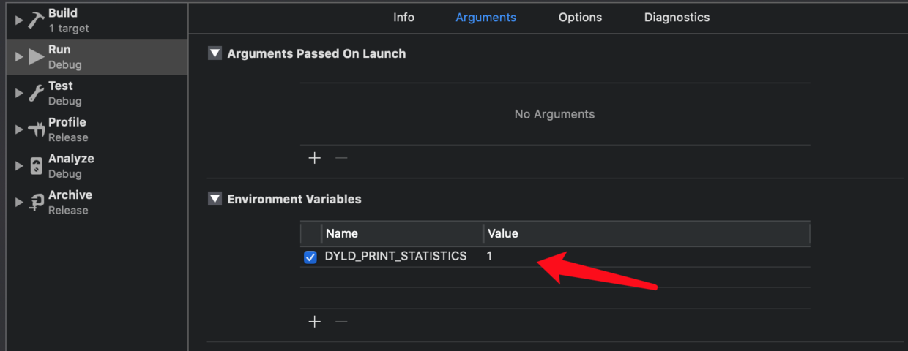

# APP启动优化

从用户点击icon到用户能够与APP内页面进行交互，大致可分为4个阶段：

**阶段1: 点击icon到执行main\(\)函数前** 获取到main\(\)函数执行前，时间耗费分配情况。 

> 从以上日志可以看出，pre-main阶段： **dylib loading time**: 加载动态链接库。每一个动态库有它自己的依赖关系，所以会消耗时间去查找和读取。 **rebase/binding time**: 重构和绑定，rebase会修正调整处理图像的指针，并且会设置指向绑定\(binding\)外部的图像指针。 **ObjC setup time**: 在Objective-C的运行时\(runtime\)，需要对类\(class\)，类别\(category\)进行注册，以及选择器的分配。 **initializer time**: 初始化，执行+load方法，创建静态全局变量等。

这个阶段可以做的优化： 1. 减少动态库加载。当数量较多的时候，需要将多个动态库进行合并； 2. 减少不使用的类、类别和方法； 3. 使用+initialize\(\)方法替换+load\(\)方法；

**阶段2: main\(\)函数到`didFinishLaunch`首屏渲染相关方法执行完成**

> 首屏初始化相关配置，及其文件的读写

这个阶段可以做的优化： 首屏渲染完成前，将与其无关的业务代码放到之后进行，优先保证首屏的渲染。

**阶段3: 首屏渲染完成到 `didFinishLaunch`方法作用域结束时结束** 开发中常见，由于业务不断迭代，`didFinishLaunch`方法里面的业务代码也越来越多，比如第三方服务的初始化、监听注册、配置文件读写等。这些都应该放在首屏渲染完成后去做。

**阶段4: 首页**

> 这个阶段完成后，代表用户已经可以与app进行交互。

常常因为线程安全、文件读写、网络请求数据量过大等等原因导致页面已可见但是不能交互，或者卡顿甚至卡死。应该尽量规避这中启动过载。 1. 厘清业务优先级，可延时业务应该静默执行； 2. 使用Time Profiler。

参考： [WWDC2016:Optimizing App Startup Time](https://developer.apple.com/videos/play/wwdc2016/406/)

