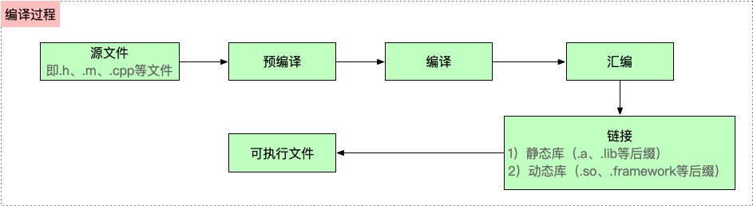

# APP编译原理

**源文件**：载入.h、.m、.cpp等文件

**预处理**：替换宏，删除注释，展开头文件，产生.i文件

**编译**：将.i文件转换为汇编语言，产生.s文件

**汇编**：将汇编文件转换为机器码文件，产生.o文件

**链接**：对.o文件中引用其他库的地方进行引用，生成最后的可执行文件



```text
 oc -> c/c++ ->汇编 -> 机器
```

```text
// 生成64位真机编译c++文件
xcrun -sdk iphoneos clang -arch arm64 -rewrite-objc main.m -o main-arm64.cpp

```

