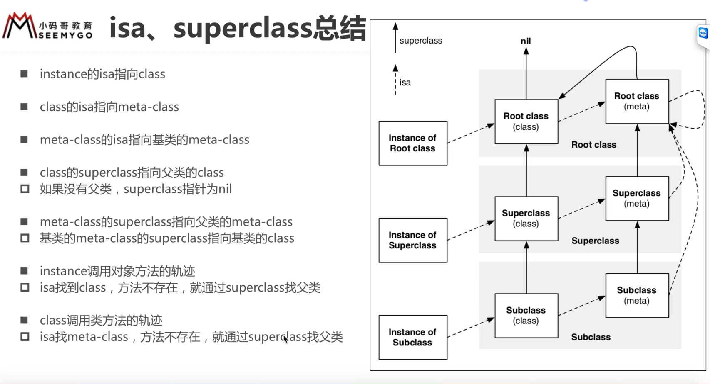

# NSObject 对象本质

> Q: 一个 NSObject 对象占用多少内存？
>
> class-getinstance-size VS malloc-size VS sizeof\(\)

* 类的本质是结构体，结构体成员变量 isa 的地址就是该结构体的地址
* 内存对齐
* GNU 

**实例对象 VS 类对象 VS 元类对象**

1. 每个类对象在内存中只有一个；
2. class 获取的一直是类对象，如：\[NSObject class\] class\] class\] 永远返回类对象
3. 类方法都是放在类对象中；

> **isa 的一个细节**
>
> 实例对象isa和类对象的内存地址不一致

**oc中类的数据结构：**

