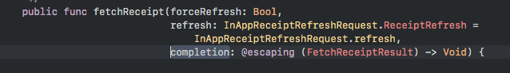

# foo

**一个陌生的swift的语法**

 方法摘自[SwiftyStoreKit](https://github.com/bizz84/SwiftyStoreKit)的`InAppReceiptVerificator.swift`，其中`refresh`参数的“=”意义在哪儿？？

**调用有返回值函数，但是没有接收方时候的警告问题** 1. @discardableResult声明 2. 调用时候使用通配符来接受值

