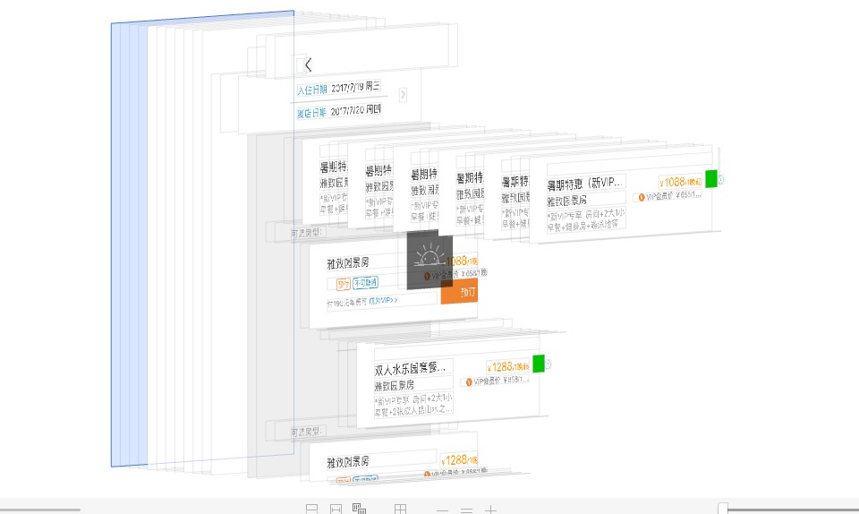

# 关于 UICollectionView/UITableView

## UIcollectionview

1. 必须注册
   * xib

     ```text
        registerNib
     ```

   * 非xib

     ```text
       registerClass
     ```
2. 
## UICollectionViewflowlayout

## 使用xib创建可复用的UITableViewHeaderFooterView

1）记录一个使用UITableViewHeaderFooterView复用的问题：



展开 收起多点了几次 发现headerview的复用有问题，与此同时的，展开首次时候的跳动混乱问题，估计也与此有关系。

实践下来发现 只有 'viewForHeaderView'返回的view只能是代码创建的 IB创建的View都会存在诡异的跳动问题。

t1: 单纯return view 不采用headerview的复用机制，在iPhone4等低性能急性上上会很卡，恩本划不动。。。 t2: 采用复用机制，继承于UITableViewHeaderFooterView，使用xib创建复杂view，会出现创建多个headerview的情况。 t3:

